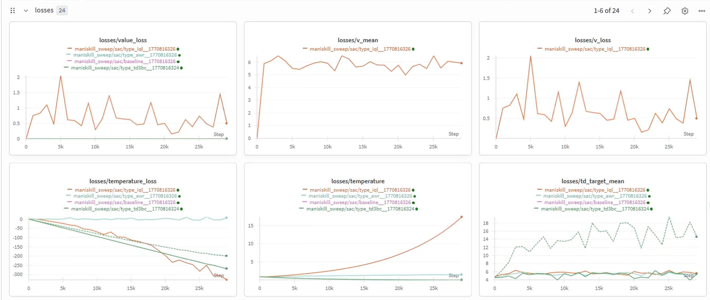
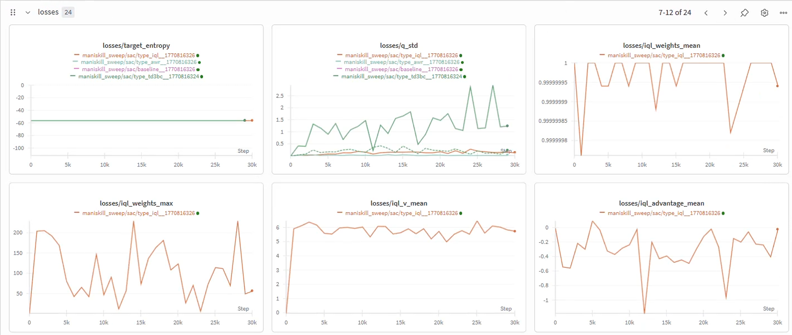
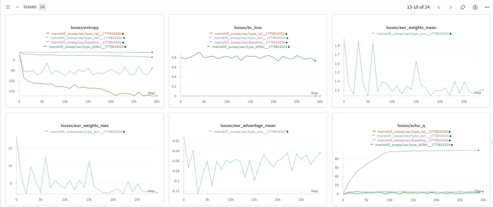

# Offline SAC 失败分析

> 实验：`maniskill_sweep/sac/` — 4 种 actor_loss_type（baseline/sac, td3bc, awr, iql）  
> 环境：LiftPegUpright-v1，30k iterations，成功率 ≈ 0

## Loss 曲线截图

| 截图 | 内容 |
|------|------|
|  | value_loss, v_mean, v_loss, temperature_loss, temperature, td_target_mean |
|  | target_entropy, q_std, iql_weights_mean, iql_weights_max, iql_v_mean, iql_advantage_mean |
|  | entropy, bc_loss, awr_weights_mean, awr_weights_max, awr_advantage_mean, actor_q |
|  | actor_lam, actor_entropy, q_mean, loss, critic_loss, actor_loss |

---

## 一、根本原因：DiagGaussianActor 的架构缺陷

`DiagGaussianActor` 用一个 MLP 输出 `act_horizon × action_dim = 8×7 = 56` 维的 **独立对角高斯分布**，这从根本上不适合 action-chunking 场景：

- **无时序归纳偏置**：MLP 将 56 维动作当做扁平向量输出，没有 UNet 那样的时序卷积结构。专家演示的动作序列（reach→grasp→lift）具有强时序关联，对角高斯只对均值建模了这种关联（通过 MLP 参数），但方差维度间完全独立
- **单模态分布**：tanh-squashed 高斯本质是单峰的，而演示数据可能存在多模态（不同抓取策略），flow-based actor 天然支持多模态
- **56 维空间里任意采样几乎都是 OOD**：在如此高维空间中，策略从高斯中随机采的动作基本不会落在数据流形附近，导致 Q 对这些 OOD 动作的评估完全不可靠

> 对比：AWCP/CPQL 用 `VelocityUNet1D`（5.93M 参数的 1D U-Net）作为 actor，通过时序卷积+FiLM 条件，天然建模动作序列的时间结构。

---

## 二、各模式的具体病理

### 2.1 Baseline (Pure SAC) — Q 开发 OOD 动作

- `actor_loss` 持续变负 → 策略找到 Q 高估的 OOD 动作区域
- `entropy` 从 +10 降到 -40 → 策略坍缩到窄区域
- 经典的离线 SAC 失败模式：无数据约束 + Q 外推 = 灾难

### 2.2 TD3+BC — Q 过估导致 lam 归零

- `actor_q` 从 5 暴涨到 100：actor 找到 Q 高估区域
- `actor_lam` 从 0.35 降到 ~0：因为 `lam = α / (α + mean|Q|)`，Q → 100 时 lam → 0.01
- lam → 0 意味着 loss 完全退化为纯 BC（MSE），Q 指导完全失效
- `bc_loss` ≈ 0.8（稳定但不够低）→ 高斯 MLP 拟合专家数据能力有限

### 2.3 AWR — 优势信号过弱

- `awr_advantage_mean` ≈ -0.05（非常小）→ 归一化后的权重几乎是均匀的（weights_mean ≈ 1.5）
- `entropy` 从一开始就是 -60 → 策略立即坍缩为数据分布的均值拟合
- AWR 本质是 `L = -w * log π(a|s)`，当 w ≈ 1（优势无差异化）时退化为纯 BC
- 纯 BC 的高斯策略表达力不够 → 无法准确复现专家动作

### 2.4 IQL — 温度爆炸 + Q 发散

- **温度爆炸**（1 → 15）是最严重的问题：
  - `entropy` = -100，`target_entropy` = -56
  - `temp_loss = -log_α * (log_prob + target_entropy)` 中 `log_prob ≈ +100`
  - `log_prob + target_entropy ≈ 100 - 56 = 44 > 0` → 梯度驱动 α 不断增大
  - 但 IQL 的 actor loss 中 α 只出现在 **额外的熵 bonus** 里，**不在 advantage-weighted 主项中**
  - 所以 α 增大无法真正提高策略熵 → 形成正反馈死循环
- `q_std` 在 20k 后暴涨到 2.5+：ensemble Q 发散
- `iql_weights_max` 达到 50-230：极端的权重离群值主导训练

---

## 三、温度自调节对离线 RL 的不适配

温度自调节（SAC 核心机制）的假设链在离线 RL 中完全断裂：

```
α↑ → (online) 策略探索更多 → 环境反馈 → 发现好动作 → Q 学到 → 策略改进
```

在离线设定中：
- α↑ → 策略采样更分散 → **但这些动作不在数据中** → Q 对它们的评估是错误的 → 无法改进
- 对 IQL/AWR（无 reparameterization），α 甚至无法影响 actor loss 的主项梯度方向

---

## 四、总结：问题对应关系

| 问题源 | 影响的模式 | 表现 |
|--------|----------|------|
| MLP 高斯架构不适合 action chunking | **全部** | bc_loss ≈ 0.8（flow BC 通常 <0.1），成功率=0 |
| Q 在 56D 空间外推 | baseline, td3bc | actor_q 爆炸，lam → 0 |
| 温度自调节正反馈 | iql（最严重）, baseline | temperature 15+，entropy 坍缩 |
| advantage 信号被噪声淹没 | awr, iql | weights ≈ 均匀，退化为纯 BC |

---

## 五、结论

**Gaussian MLP actor 在 action-chunked 离线 RL 中存在架构性缺陷。** 这不是超参数调整能解决的问题，而是需要换成 flow-based actor（如 AWCP/DQC）来获得足够的动作序列表达力。SAC 的结果可以作为 baseline 对照，证明 flow actor 的必要性。
